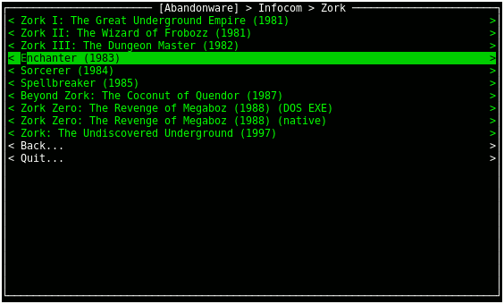

"Abandonware" Game Launcher
===========================

* [Overview](#overview)
* [Installation](#installation)
* [Configuration](#configuration)
* [Usage](#usage)
* [Extending](#extending)
* [License](#license)

Overview
--------

This is a little Python 3 app to launch "abandonware" easily from
my console.  It looks like this:



I am well aware that "abandonware" is not a real thing, and that
even if it were, it'd be increasingly less common thanks to the
fine work of places like [GOG](https://www.gog.com).  Regardless,
I've got a bunch of old games which are used via Dosbox, Z-machine
interpreters like [Frotz](http://frotz.sourceforge.net/), or
(less commonly) console emulators.  I wanted to have them all via
a nice easily-traversed TUI menu system, and hence this silly
little app was born.

This was developed on Linux.  It could possibly be useful to
someone on MacOS/OSX.  It could maybe run in Cygwin on Windows,
but good luck on that front.

I'd be a bit surprised if anyone but me finds this useful, but
figured I'd put it out there just in case.

Installation
------------

This is a Python script which requires at least Python 3.7, and
uses [urwid](http://urwid.org/) for the TUI stuff.  It could
be pretty easily adapted to run on lower versions of Python,
but I'm using some arguments to `subprocess.run()` which were
introduced in 3.7, and I don't care enough to support lower
versions.

There's no `setup.py` or anything like that; just slap it
in your `~/bin` dir, or symlink it there, or just run it
from the git checkout.

Configuration
-------------

The app uses files named `abandon.info` on your filesystem to
know what to display on the menu.  It's hardcoded to start in
`/usr/local/games/abandon`, so you'll have to change that by
hand down at the bottom of the script.  If anyone else ever
actually uses this, feel free to bug me and I'll optionize
that or something.

From that root dir, each dir you want to include should have
one of those `abandon.info` files.  The simplest is a category
file, which just creates a folder/category:

```
cat: Other
sort: ZZZ
```

`sort` is optional but can be used to sort entries by something
other than their category/name.

For games themselves, here's my Zork III `abandon.info`:

```
name: Zork III: The Dungeon Master (1982)
sort: zork 03
type: zmachine
rom: Zork 3 R17-840727.z3
```

`name` is what's shown in the menu, of course.  `sort` is
still optional, and will override `name` when sorting the list.
`type` can currently be one of:

* `dosbox`
* `dos` *(launches dosbox)*
* `fceux`
* `nes` *(launches fceux)*
* `snes9x-gtk`
* `snes` *(launches snes9x-gtk)*
* `dolphin`
* `gameboy` *(launches dolphin)*
* `visualboyadvance-m`
* `gb` *(launches visualboyadvance-m)*
* `gba` *(launches visualboyadvance-m)*
* `ps2` *(launches pcsx2)*
* `pcsx2`
* `frotz`
* `grotz`
* `zmachine` *(launches frotz)*

The idea behind having a "generic" name is that some games may
end up working better with some emulators/interpreters/environments
over others.  For instance, I prefer using
[frotz](http://frotz.sourceforge.net/) for most of my z-machine
games, but some of them require the fancier stuff that
[grotz](http://www.kevinboone.net/README_grotz.html) provides.
But rather than hardcode frotz for all the others, I can specify
just `zmachine` and change the "default" later, should I decide
I'd rather run *all* of them in grotz.  (Or even some other
z-machine interpreter altogether.)

All types except for DOS/Dosbox require a `rom` parameter in the
`abandon.info` file.  DOS/Dosbox *can* specify the `rom` parameter
to auto-launch an EXE/COM/BAT file, but will otherwise just map
the `C:` drive and leave it there:


By default, dosbox games will use `~/.dosbox/dosbox.conf` for the
configuration.  If the file `abandon.conf` exists in the game's
dir, though, it will use that instead.

That's about it!  The directory you're "in" while running the
app is scanned for `abandon.info` files each time you enter or
leave, so if you make changes to the files, or add/delete
directories with `abandon.py` still running, those changes will
be refreshed by going out and back in to the dir in question.

Usage
-----

This is quite straightforward, of course.  Arrow keys and enter
will be your primary input methods, though thanks to using
urwid for the TUI stuff, you should be able to click with your
mouse too, should you want to do that.

You can also hit `b` to go back to the previous dir, and `q` to
quit the app.  `o` can be used to open up an xterm inside the
currently-selected menu item.

Categories show up in yellow, launchable games show up in green.
If there are any errors in an `abandon.info` file, there'll be
a red entry in the list.

Extending
---------

I thought about being clever with what emulators/interpreters/etc
were supported, but since I'm likely to be the only user this thing
ever has, in the end I didn't care.  The supported `type` parameters
are specified in a couple of vars at the top of the `InfoFile`
class, and then their commandlines are constructed inside that
class's `activate` function.  It'd be quite trivial to add new
ones.

License
-------

This is licensed under the [3-clause BSD license](https://opensource.org/licenses/BSD-3-Clause).
See [COPYING.txt](COPYING.txt).

